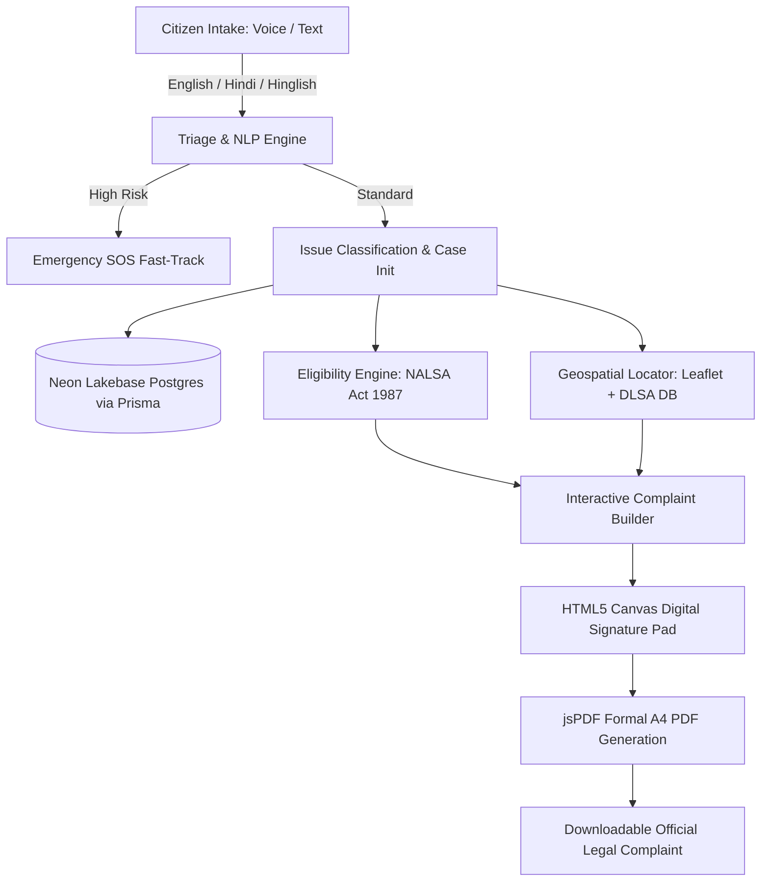

<div align="center">

# ⚖️ Nyay Sahayak (न्याय सहायक)
### *AI-Powered Legal Aid Triage & Automated Complaint Generation for Indian Citizens*

[-000000?style=for-the-badge&logo=next.js&logoColor=white)](https://nextjs.org/)
[](https://neon.tech/)
[](https://www.prisma.io/)
[](https://tailwindcss.com/)
[](https://developer.mozilla.org/en-US/docs/Web/API/Web_Speech_API)
[](https://leafletjs.com/)

<p align="center">
  <b>Bridging India's justice gap through natural language processing, automated eligibility evaluation under Article 39A / NALSA Act 1987, geospatial legal-aid lookup, and digital complaint drafting.</b>
</p>

---

</div>

## 📌 Executive Summary & Problem Statement

In India, millions of citizens entitled to **free legal aid under the Legal Services Authorities Act, 1987 (Article 39A)** never access it due to:
* **Complex legal jargon** and fear of intimidating legal processes.
* **Language barriers and illiteracy** preventing formal written complaints.
* **Lack of awareness** regarding District Legal Services Authority (DLSA) offices and free legal aid eligibility.

**Nyay Sahayak ("Justice Assistant")** is an end-to-end civic-tech platform designed to democratize legal access. It allows any citizen to describe their problem in plain language (via speech or text in Hindi, English, or Hinglish), classifies the legal domain, evaluates free aid eligibility, locates the nearest DLSA helpdesk, and generates a formal, digitally signed PDF complaint ready for submission.

---

## 🌟 Key Engineering Features

### 🎙️ 1. Multilingual Speech-to-Text & Smart Triage
* **Voice-First Accessibility**: Implements the browser-native **Web Speech API** for real-time speech recognition in **Hindi (`hi-IN`)**, **English (`en-IN`)**, and phonetic **Hinglish**.
* **Rule-Based Issue Classification**: Categorizes plain-text descriptions into standard legal domains (Domestic Violence, Labor/Wage Disputes, Consumer Fraud, Property Conflicts, Criminal Harassment).
* **Automated Emergency & Risk Detection**: High-risk scenarios (e.g., immediate domestic danger) trigger a prioritized **Fast-Track SOS Mode** with one-tap emergency hotlines (112, 1091, 1098).

### 🏛️ 2. Dynamic Legal Aid Eligibility Calculator
* Automatically calculates statutory eligibility under **Section 12 of the Legal Services Authorities Act, 1987**.
* Evaluates demographic waivers (automatic free aid for women, children, industrial workmen, SC/ST) and state-wise annual income thresholds with instant eligibility breakdowns.

### 🗺️ 3. Geospatial DLSA Office Discovery
* Interactive **Leaflet.js** map with **OpenStreetMap** tiles providing offline-resilient geospatial discovery of District Legal Services Authority (DLSA) centers.
* Calculates spatial distances using browser geolocation with direct telephone hotlines and driving directions.

### ✍️ 4. Interactive Digital Signature Pad & Live Complaint Preview
* **HTML5 Canvas Signature Engine**: Custom touch- and stylus-responsive drawing pad with pressure-smooth stroke rendering, clear actions, and base64 export.
* **Real-time Live Preview**: Dynamically compiles user statements and legal details into formal, legally structured complaint drafts.

### 📄 5. Client-Side A4 PDF Document Generation
* Uses **jsPDF** to programmatically generate formatted, multi-page **A4 PDF formal complaints** containing timestamped case metadata, statutory references, and the user's embedded digital signature.

---

## 🏗️ System Architecture



---

## 💻 Tech Stack & Technical Decisions

| Layer | Technology | Architectural Decision / Why It Was Chosen |
| :--- | :--- | :--- |
| **Frontend Framework** | **Next.js 14 (App Router)** | Server-side rendering (SSR) for lightning-fast loads, optimized client components for interactivity, and integrated serverless API routes. |
| **Styling & UI** | **Tailwind CSS + Framer Motion** | Micro-interactions and calming animations designed to reduce user anxiety in stressful legal situations while adhering to WCAG AA accessibility standards. |
| **Database** | **PostgreSQL on Neon** | Modern serverless database with automatic scaling, connection pooling for high-concurrency serverless routes, and isolated branching for development. |
| **ORM** | **Prisma ORM** | Type-safe schema management with relational integrity across Users, Cases, Drafts, and DLSA Offices. Configured with dual connection strings (`url` pooled + `directUrl` unpooled). |
| **Voice Intake** | **Web Speech API** | Client-side acoustic recognition without third-party API dependencies or user privacy tracking. |
| **Mapping** | **Leaflet + OpenStreetMap** | Zero-API-key mapping solution ensuring continuous public availability without billing limits. |
| **Document Engine** | **jsPDF + HTML5 Canvas** | 100% client-side PDF synthesis with embedded digital signature graphics — no sensitive user complaint data is stored or processed on third-party PDF servers. |

---

## 📁 Repository Structure

```
├── app/
│   ├── api/
│   │   ├── classify/        # Issue classification & case initialization route
│   │   ├── cases/[id]/      # Case retrieval & category override endpoint
│   │   ├── dlsa/            # DLSA office directory & spatial lookup
│   │   └── health/          # Database health monitoring endpoint
│   ├── triage/              # Voice/Text intake wizard with live audio visualizer
│   ├── results/             # Legal aid eligibility assessment & category match
│   ├── locator/             # Interactive DLSA map directory
│   ├── generate/            # Digital signature pad & complaint PDF builder
│   └── sos/                 # Immediate safety & emergency hotline mode
├── components/              # Modular UI components (Navbar, Footer, Map, Modals)
├── context/                 # Application state (LanguageContext, CaseSession)
├── lib/                     # Prisma database singleton & rule-based classification
├── prisma/
│   ├── schema.prisma        # Database models (User, Case, LegalCategory, DLSAOffice)
│   └── seed.js              # Initial dataset for legal categories & DLSA locations
└── neon.ts                  # Neon Infrastructure-as-Code configuration
```

---

## ⚡ Getting Started (Local Development)

### 1. Clone & Install Dependencies
```bash
git clone https://github.com/<your-username>/nyay-sahayak.git
cd nyay-sahayak
npm install
```

### 2. Configure Environment Variables
Create a `.env.local` file in the root directory:
```env
DATABASE_URL="postgresql://<USER>:<PASSWORD>@localhost:5432/<DATABASE_NAME>"
DATABASE_URL_UNPOOLED="postgresql://<USER>:<PASSWORD>@localhost:5432/<DATABASE_NAME>"
```

### 3. Initialize Database & Seed Records
```bash
npx prisma db push
node prisma/seed.js
```

### 4. Launch Development Server
```bash
npm run dev
```
Open [http://localhost:3000](http://localhost:3000) to view the application.

---

## 🔒 Security, Privacy & Accessibility

* **Zero-Storage Voice Processing**: Speech-to-text processing is handled in-memory by the browser; audio recordings are never stored on disk.
* **WCAG AA Compliance**: High-contrast theme palette (`#D85A30` Saffron, `#0F6E56` Forest Teal, `#FAF9F6` Soft Base) tested for readability across devices.
* **Crash-Resilient Layouts**: Integrated Next.js boundary handlers (`error.js`, `not-found.js`) guarantee emergency SOS hotlines remain permanently visible even during system errors.

---

<div align="center">
  <sub>Built with ❤️ for public-interest civic innovation and equitable justice in India.</sub>
</div>
